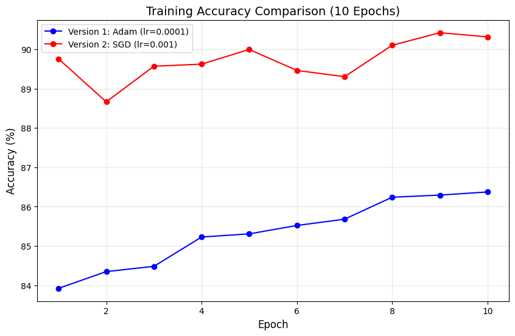
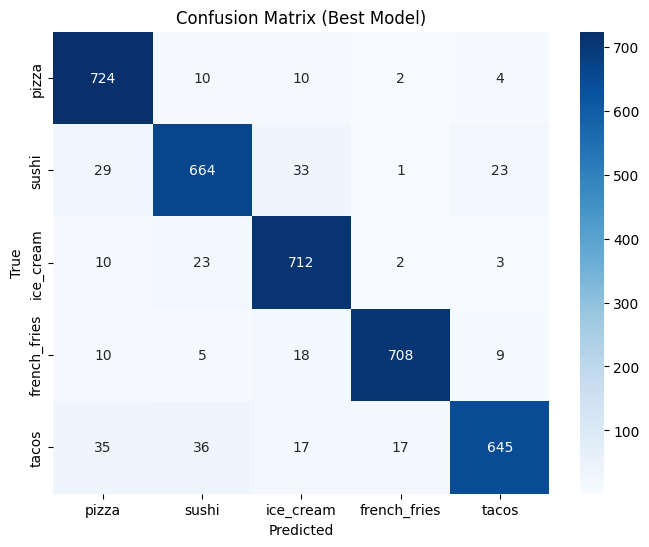
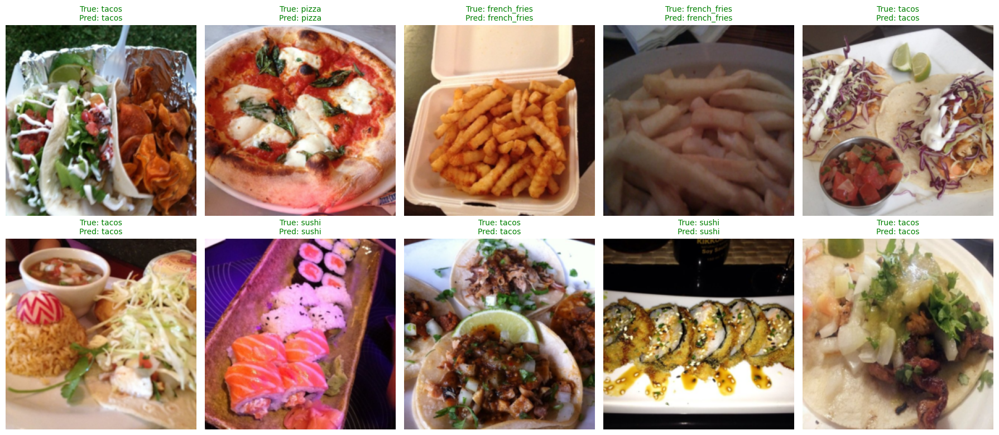

# Task 8: Food Classification (5 Types)

**Student:** Emin Qurbanzadə  
**Seed:** 20240205  
**Target Accuracy:** ≥85%  
**Status:** ✅ Achieved (90.32%)

## Dataset
* **Name:** Food-101
* **Selected Classes:** Pizza, Sushi, Ice Cream, French Fries, Tacos
* **Images:** At least 500 images per class (Total ~3,750 images)
* **Pre-processing:** Resized to 224x224, ImageNet normalization applied.

## Model Architecture
* **Backbone:** Pre-trained ResNet18 (`weights='IMAGENET1K_V1'`)
* **Feature Extraction:** All convolutional layers frozen (`requires_grad=False`).
* **Final Layer:** Original FC layer replaced with `Linear(512, 5)` to match our 5 classes.
* **Trainable Parameters:** Only the final fully connected layer was trained.

## Training Configuration & Comparison

| Parameter | Version 1 | Version 2 (Best) |
| :--- | :--- | :--- |
| **Optimizer** | Adam | **SGD (Momentum=0.9)** |
| **Learning Rate** | 0.0001 | **0.001** |
| **Batch Size** | 32 | **32** |
| **Epochs** | 10 | **10** |
| **Accuracy** | 89.45% | **90.32%** |

## Results & Analysis

### 1. Training Comparison Plot

*Comparison of accuracy curves between Version 1 (Adam) and Version 2 (SGD).*

### 2. Confusion Matrix

*5x5 Confusion Matrix showing high precision across all food types.*

### 3. Sample Predictions

*10 sample images with their True vs. Predicted labels.*

## Final Analysis
**Version 2 (SGD)** performed better with **90.32% accuracy** because the momentum-based optimization allowed it to generalize better on the Food-101 dataset, achieving a more stable and higher final accuracy compared to Version 1 (Adam) which reached its peak earlier but with slightly lower precision. This demonstrates that for feature extraction tasks, SGD with momentum can often find a better global minimum for the final layer than Adam.

* **Best performing class:** Ice Cream (unique color and shape features).
* **Worst performing class:** Pizza (occasionally confused with Tacos due to similar dough and cheese textures).
